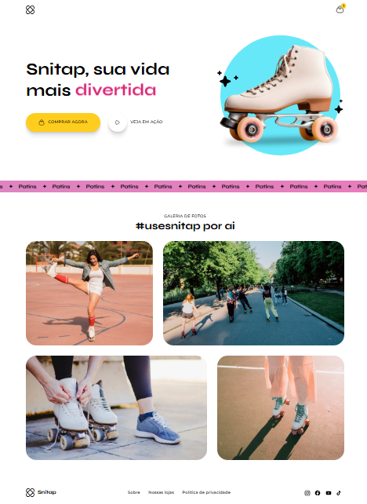

# ⛸️ Patins Animation — Snitap Patins

Projeto de treinamento com animações em CSS.

## 📖 Sobre

Página desenvolvida para praticar animações e transições em CSS, explorando efeitos visuais e interatividade sem uso de JavaScript.

## 🚀 Tecnologias

- HTML5
- CSS3 (animations/transitions)

## 🔗 Acesse o projeto

https://maathxx.github.io/patins-animation/

## 👨🏽‍💻 Autor

Desenvolvido por **[Matheus Oliveira](https://github.com/maathxx)**.

